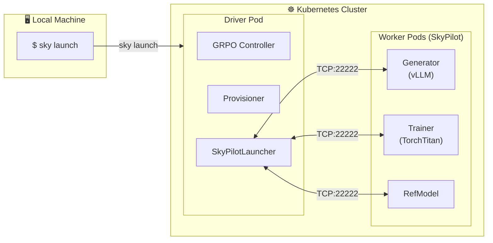

# Running TorchForge on Kubernetes and Cloud VMs via SkyPilot

This directory contains examples for running TorchForge GRPO training on **Kubernetes and cloud VMs** via [SkyPilot](https://github.com/skypilot-org/skypilot).

## Overview

The SkyPilot integration allows TorchForge to provision and manage distributed training workloads across:
- **Kubernetes** (any cluster)
- **Hyperscalers**: AWS, GCP, Azure
- **Neoclouds**: CoreWeave, Nebius, and [20+ other clouds](https://docs.skypilot.co/en/latest/getting-started/installation.html)

### Architecture



**How it works:**
1. You run `sky launch` from your laptop to start the driver pod
2. The driver runs `apps.grpo.main` with `launcher: skypilot` in the config
3. `SkyPilotLauncher` provisions GPU worker pods via SkyPilot
4. Workers install TorchForge and download HuggingFace models during setup
5. The driver connects to Monarch workers over TCP (port 22222)
6. Actors (Generator, Trainer, RefModel) are spawned on worker pods

## Quickstart

### Prerequisites

1. **Install SkyPilot** on your local machine:

```bash
pip install skypilot[kubernetes]  # For Kubernetes
pip install skypilot[aws]         # For AWS
pip install skypilot[gcp]         # For GCP
pip install skypilot[all]         # For all clouds
```

2. **Verify SkyPilot setup**:

```bash
sky check
sky show-gpus --infra kubernetes  # For K8s
```

For detailed setup, see the [SkyPilot documentation](https://docs.skypilot.co/en/latest/getting-started/installation.html).

### Running GRPO Training

From your local machine (with kubectl/kubeconfig configured):

```bash
cd torchforge/experimental/skypilot
sky launch torchforge_grpo.sky.yaml -c forge-grpo
```

This will:
1. Launch a driver pod in your Kubernetes cluster
2. Install TorchForge and dependencies on the driver
3. Start the GRPO training loop
4. Provision worker pods for Generator, Trainer, and RefModel
5. Install TorchForge and download models on workers
6. Begin training with metrics logging

### Customizing the Configuration

Override environment variables to customize the run:

```bash
# Use different GPU types
sky launch torchforge_grpo.sky.yaml -c forge-grpo \
  --env ACCELERATOR="A100:4"

# Use a different config file
sky launch torchforge_grpo.sky.yaml -c forge-grpo \
  --env CONFIG=my_custom_config.yaml
```

### Monitoring and Debugging

```bash
# View driver logs
sky logs forge-grpo

# SSH into the driver pod
ssh forge-grpo

# Check worker pod status (run from driver pod)
ssh forge-grpo "sky status"

# View worker logs (run from driver pod before teardown)
ssh forge-grpo "sky logs <worker-cluster-name>"
```

### Cleanup

```bash
# Tear down the driver and all worker pods
sky down forge-grpo

# Remove all clusters
sky down --all
```

## Configuration Reference

### TorchForge Config (qwen3_8b.yaml)

The key section for SkyPilot is the `provisioner` block:

```yaml
provisioner:
  launcher: skypilot
  cloud: kubernetes      # Cloud provider: kubernetes, aws, gcp, azure
  accelerator: "H100:8"  # GPU spec per worker node
  job_name: my_grpo_job  # Cluster name prefix
  idle_minutes_to_autostop: 30  # Auto-cleanup after idle
  model_name: Qwen/Qwen3-8B     # HuggingFace model to pre-download on workers
```

### Model Pre-download

The `model_name` parameter is **required** for HuggingFace models. Workers will download the model during setup using:

```bash
huggingface-cli download <model_name> --local-dir <model_name>
```

This ensures TorchTitan's checkpointer can find the model at the expected path (e.g., `Qwen/Qwen3-8B`).

> **Note**: When using `hf://` prefixes in your config (e.g., `hf://Qwen/Qwen3-8B`), the SkyPilot launcher automatically strips the prefix. Workers download models themselves rather than relying on the driver's cache.

### Resource Allocations

Services and actors with `hosts: N` will be provisioned on remote worker pods:

```yaml
services:
  generator:
    procs: 1              # Number of processes (typically matches tensor_parallel_size)
    hosts: 1              # Runs on 1 remote worker pod
    with_gpus: true
    mesh_name: generator

actors:
  trainer:
    procs: 1
    hosts: 1              # Runs on 1 remote worker pod
    with_gpus: true
    mesh_name: trainer
```

**GPU Assignment**: Each actor/service with `with_gpus: true` gets `procs` GPUs assigned. The `accelerator` config (e.g., `H100:1`) specifies how many GPUs are available per worker node. Ensure `procs` ≤ GPUs per node.

Services/actors without `hosts` or with `hosts: 0` run locally on the driver pod.

## Supported Clouds

| Cloud | Installation | Notes |
|-------|--------------|-------|
| Kubernetes | `pip install skypilot[kubernetes]` | Driver must run inside cluster |
| AWS | `pip install skypilot[aws]` | Requires AWS credentials |
| GCP | `pip install skypilot[gcp]` | Requires GCP credentials |
| Azure | `pip install skypilot[azure]` | Requires Azure credentials |

See [SkyPilot Cloud Setup](https://docs.skypilot.co/en/latest/getting-started/installation.html) for credential configuration.

## Network Requirements

- **Kubernetes**: The driver pod must be inside the same cluster as worker pods
- **Cloud VMs**: Security groups must allow inbound traffic on port 22222

## Dependency Management

Worker pods install dependencies using `uv pip install -e .` from the synced TorchForge repository. This respects `pyproject.toml`'s `[tool.uv.sources]` section, which is critical for:

- **vllm**: Must come from the PyTorch forge preview index (contains development version with required modules)
- **torch**: Comes from the cu128 index for CUDA 12.8 support

Key version requirements:
- `torchmonarch-nightly`: Must match the driver's version exactly (serialization compatibility)
- `transformers>=4.50,<5.0`: Required for vllm compatibility

## Performance Tips

### Reduce Workdir Sync Time

Add a `.skyignore` file in the TorchForge root to exclude large directories:

```
# .skyignore
.git/
*.pyc
__pycache__/
.venv/
```

This significantly speeds up the workdir sync, especially if your `.git` directory is large.

### Optimize Setup Time

For faster cold starts, consider using a custom Docker image with pre-installed dependencies:

```yaml
resources:
  image_id: docker:your-registry/torchforge-base:latest
```

## Troubleshooting

### Check SkyPilot Configuration

```bash
sky check
sky show-gpus --infra kubernetes
```

### View Worker Logs

Worker pods are torn down when the driver fails. To debug worker issues, **SSH into the driver quickly** before teardown:

```bash
# From your laptop, SSH into driver
ssh forge-grpo

# From driver, view worker logs
sky logs <worker-cluster-name> 1  # Job 1 logs

# Check installed vllm version
ssh <worker-cluster-name> "python -c 'import vllm; print(vllm.__version__)'"
```

### SSH into Workers

```bash
# From driver pod
ssh <worker-cluster-name>
```

### Common Issues

| Issue | Cause | Solution |
|-------|-------|----------|
| `ModuleNotFoundError: No module named 'vllm.executor'` | Wrong vllm version on workers | Ensure workers install TorchForge using `uv pip install -e .` (respects pyproject.toml index sources) |
| `checkpoint.initial_load_path is not valid` | Model not downloaded on workers | Add `model_name` to provisioner config |
| `SkyPilot is not installed` | Missing SkyPilot on driver | Check `torchforge_grpo.sky.yaml` setup script installs `skypilot[kubernetes]` |
| Connection timeout | Network issues | Ensure driver and workers are in the same cluster/VPC; check port 22222 is open |
| GPU not available | Scheduling issues | Check `sky show-gpus --infra kubernetes` for available GPUs |
| Pod scheduling issues | Resource constraints | Check Kubernetes node resources, taints, and tolerations |
| `Timeout spawning proc mesh` | Mismatch between requested procs and available GPUs | Ensure `procs` ≤ `accelerator` GPU count (e.g., `procs: 1` with `H200:1`) |
| Slow workdir sync | Large .git directory | Add `.skyignore` with `.git/` |
| `torchmonarch` serialization error | Version mismatch | Ensure workers install the exact same `torchmonarch-nightly` version as driver |

### Debugging Workflow

1. **Launch and monitor**:
   ```bash
   sky launch torchforge_grpo.sky.yaml -c forge-grpo
   sky logs forge-grpo -f  # Follow logs
   ```

2. **If training fails, SSH quickly**:
   ```bash
   ssh forge-grpo
   sky status  # Note worker cluster name
   sky logs <worker-cluster-name> 1  # View worker setup/run logs
   ```

3. **Check versions on workers**:
   ```bash
   ssh <worker-cluster-name>
   python -c "import vllm; print(vllm.__version__)"
   python -c "import monarch; print(monarch.__version__)"
   ls -la Qwen/Qwen3-8B  # Verify model downloaded
   ```

4. **Iterate on driver** (without restarting workers):
   ```bash
   # Edit config locally, then rsync to driver
   rsync -avz src/forge/ forge-grpo:~/sky_workdir/src/forge/
   ssh forge-grpo "cd ~/sky_workdir && python -m apps.grpo.main --config ..."
   ```

## Files in This Directory

| File | Description |
|------|-------------|
| `torchforge_grpo.sky.yaml` | SkyPilot task YAML to launch the driver pod |
| `qwen3_8b.yaml` | TorchForge GRPO config for Qwen3-8B on SkyPilot |
| `README.md` | This documentation |

## Implementation Details

The SkyPilot integration is implemented in:

- `src/forge/controller/launcher.py`: `SkyPilotLauncher` class that interfaces with SkyPilot
- `src/forge/controller/skypilot_job.py`: `SkyPilotJob` Monarch JobTrait for provisioning workers
- `src/forge/types.py`: `LauncherConfig` with SkyPilot-specific fields
- `src/forge/util/config.py`: Logic to strip `hf://` prefixes for SkyPilot

The worker setup script in `skypilot_job.py`:
1. Installs git and system dependencies
2. Installs TorchForge with all dependencies via `uv pip install -e .`
3. Pins `torchmonarch-nightly` and `transformers` versions
4. Downloads HuggingFace models using `huggingface-cli download --local-dir`
